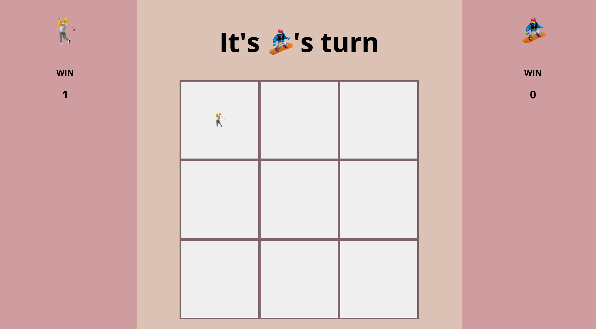

______________________________________________________  

# PS Tic Tac Toe 

### Abstract:
This game allows 2 users to play game of Tic Tac Toe. Players can keep playing multiple games and collecting scores. The board will show the current player token and alternate the player token once one player select the location. Once the player either win or draw the board wth automaticly clear and restart the game. The left and right side of the board show the current number of accumulated wins. When refresh the page it will restart the board and clear out any scores. 

### Installation Instructions:

To install the app, open terminal, navigate to your desired directory (also known as a folder), and then enter "git clone git@github.com:pattpjy/tictactoe.git" and hit enter/return. Terminal will download the files and install them into your chosen directory. 

### Preview of App:

### Context:

This is my last project of Mod1 and it's a solo project. The architect of the application followed the suggested architect. The business logics of the game live in Player.js and Game.js and the user view and interation live in HTML CSS and Main.js. In order to test the data model, I created unit test for the game.js and player.js and used browser dev tool for html and main.js for any debugging. The project breakdown is in gitHub projects section. 

### Contributors:
- Patt Sookmark - https://github.com/pattpjy, LinkedIn: https://www.linkedin.com/in/pattsookmark/

### Learning Goals:

Solidify and demonstration of DRY JavaScript
Event delegation to handle similar event listeners
Understand the difference between the data model and how the data is displayed on the DOM
Iterate through/filter DOM elements using for loops
Use your problem solving process to break down large problems, solve things step by step, and trust yourself to not rely on an outside “answer” to a logical challenge

### Wins + Challenges:

Wins: Completed a working MVP with no bug!. 

Challenges: Planning the game view and user intereaction were challenging. I ended up writing additional condition to fix bug instead of writing the functions with more thoughful consideration. 

